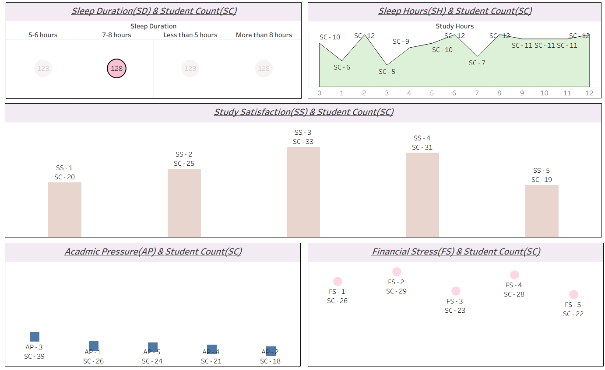

# 🧠 Student Depression Data Analysis

This project focuses on analyzing student depression data using a structured approach involving **SQL Server** for data transformation and **Tableau** for data visualization. The aim is to uncover patterns, trends, and possible factors associated with student depression.

---

## 📁 Dataset

- Format: **Excel (.xlsx)**  
- Features: Age, gender, study hours, sleep hours, mental health responses, etc.
- 📄 [Download Dataset](./Depression+Student+Dataset.xlsx)
---

## 📂 Project Structure

---

## 🧩 Project Workflow

### 1. Data Collection
- Data stored in Excel file: [`dataset.xlsx`](./Depression+Student+Dataset.xlsx)

---

### 2. Data Cleaning & Transformation (SQL Server)

The transformation was done in multiple sequential steps as shown below:

| Step | Description                                                         | 
|------|---------------------------------------------------------------------|
| 1️⃣   | **Importing Data to SQL Server** – Upload and create schema         | 
| 2️⃣   | **Modifying Gender Column** – Standardizing gender values           | 
| 3️⃣   | **Adding the Age Group Column** – Derived column using CASE         | 
| 4️⃣   | **Column Distribution** – Cleaning and transforming other attributes| 
| 5️⃣   | **Adding Index & Updating Depression Column** – Final structure     | 

Each of these steps is executed using corresponding `.sql` files:

| SQL File          | Associated Step Description                          |
|-------------------|------------------------------------------------------|
| [`1.sql`](./1.sql) | Step 1: Import data into SQL Server                  |
| [`2.sql`](./2.sql) | Step 2: Modify and clean gender column               |
| [`3.sql`](./3.sql) | Step 3: Create age group column                      |
| [`4.sql`](./4.sql) | Step 4: Transform remaining columns                  |
| [`5.sql`](./5.sql) | Step 5: Add index & update depression classification |

---

## 📊 Dashboard (Tableau)

Built using Tableau with visual breakdowns and filters for multidimensional analysis, including:

- Depression levels vs. academic stress, sleep hours, and gender
- Age group-wise mental health distribution
- Interactive filters and drill-down charts

---

## 📌 Dashboard Preview

  

📎 [Click here to view dashboard in full size](./Dashboard.png)
